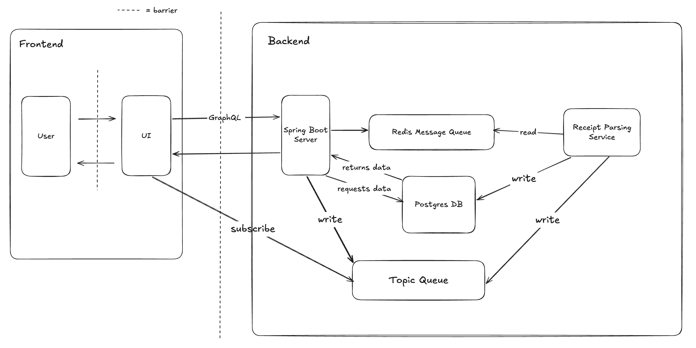
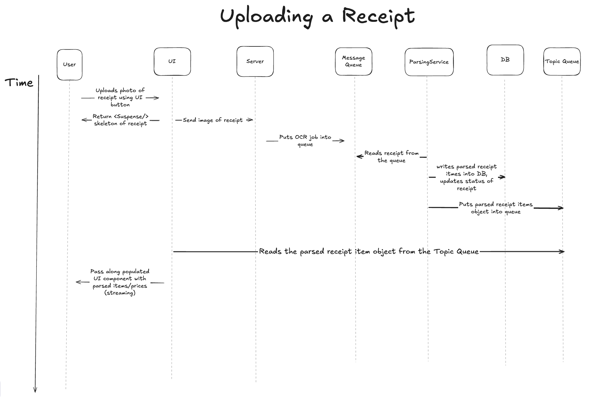
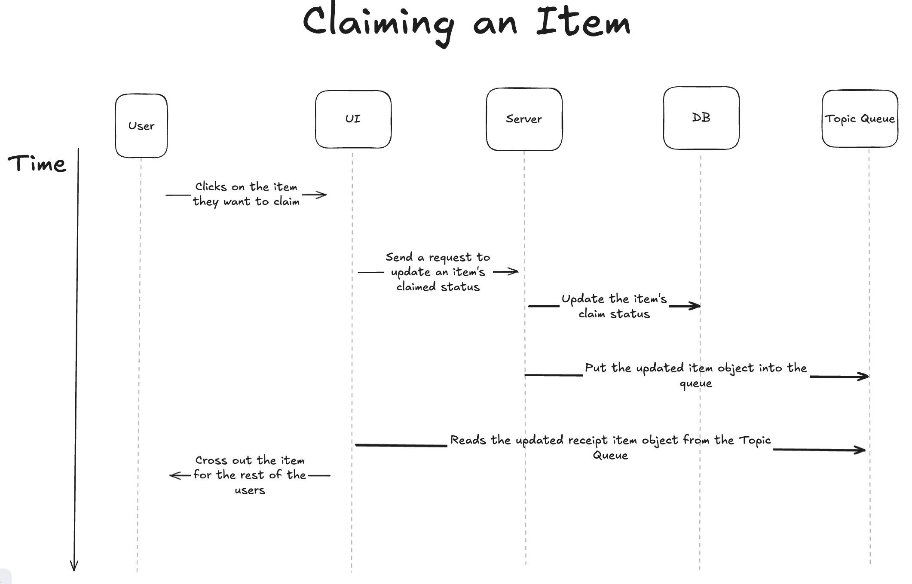
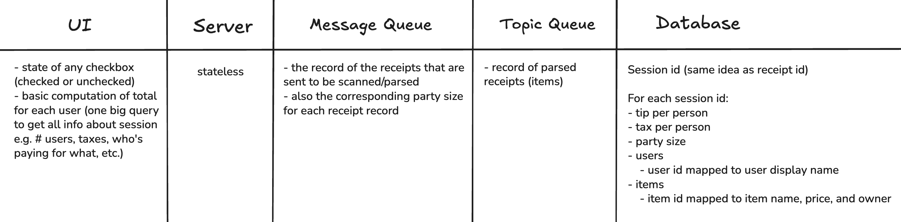
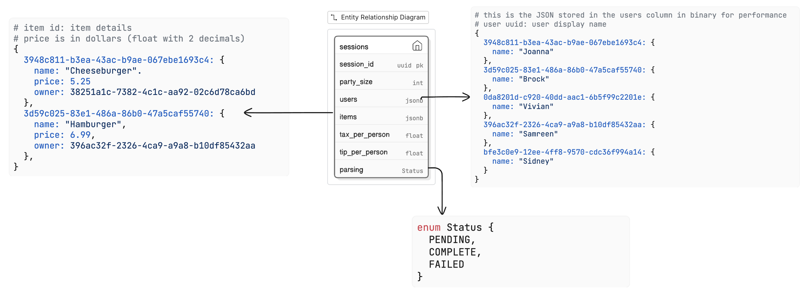

# A Better Bill Split App: Design Doc

## Architecture Overview
We will be implementing a bill splitting app where users can upload a picture of their receipt, claim items, 
and view the exact amount they are responsible for. The key functionalities for the app include:
- A group leader can upload a photo of their receipt.
- Users can see their portion of the bill calculated after claiming items from the receipt.

We will use the following tech stack:
- **Frontend:** Next.js
- **Backend:** GraphQL APIs with Spring Boot framework
- **Message Queue:** Redis
- **Database:** PostgreSQL with Supabase

### System Diagram


Our architecture is designed to handle asynchronous processing, OCR, and real-time concurrency. 
The pros and cons of our design choices are as follows:
- **Frontend:** Next.js 
  - **Pros:** It enables a fast, responsive UI for client-side rendering. This allows users a smooth 
  process of claiming and unclaiming items. 
  - **Cons:** Keeping the frontend state consistent across multiple users in real time increases 
  concurrency requirements and adds complexity to the system design, especially when session data changes often.
- **Backend:** GraphQL APIs with Spring Boot 
  - **Pros:** GraphQL allows the client to request and retrieve the necessary data they need without 
  underfetching or overfetching. 
  - **Cons:** Since the server is stateless, every user interaction, such as a call to claim and 
  unclaim an item, triggers a write to the database. This increases the load on the database and 
  requires using atomic operations when manipulating it to ensure concurrency.

### Sequence Diagrams

#### Description of Receipt Lifecycle
1. The lifecycle of a receipt begins when a group leader uploads an image of the receipt. 
This action creates a session record in the database, generates a unique session_id, and 
sets the parsing_status to pending.
2. The receipt is moved to the message queue for processing. At this time, the UI displays 
a parsing state. While items aren’t yet visible for claiming at this step, other users can 
join the session via a generated QR code provided to the group leader.  
3. Once the receipt parsing service confirms a success status, the itemized data is committed 
to the `items` column in the database, which is of type JSONB. After the database writes the topic
queue broadcasts the new data to the UI. 
4. Multiple users can concurrently claim or unclaim their items. This updates the owner mapping 
in the database in real-time. Since the server is stateless, the database acts as the source of 
truth to prevent multiple users from claiming the same items.
5. The lifecycle ends when the group leader triggers a close session event. The session state 
becomes read-only, and the bill summary is generated for all participants.

#### Receipt Upload Sequence Diagram


#### Item Claim Sequence Diagram


## State Model


## Database Schema


Our database schema includes a Sessions table for every session that is created. 
It is initialized with the party size the group leader inputs. To store information about a session efficiently, 
we will be using a document-based database. The Users column stores information about each user in a JSONB data 
format with their userID and their names. Similarly, the Items column uses JSONB to map each item’s itemID to 
its name, price, and owner. To ensure there is smooth communication and error handling between boundaries, 
we added a Parsing column to store the parsing status of the receipt at any given time. After the receipt has 
been sent to the Parsing Service, it will be marked as PENDING. After the Parsing Service sends it to the Topic Queue, 
it will mark it as COMPLETED. If there are any errors, it will be labeled as FAILED. This makes sure that the 
server and UI remain clear about what the receipt’s current status is.

## API Design

### Uploading a Receipt
**Problem:** Receipt images are raw binary data. Sending them through a standard GraphQL mutation requires Base64 
encoding, which can increase payload size and complexity by a wide margin.

**Solution:** We will use Supabase Storage (REST) for a high-performance binary upload and a GraphQL mutation to 
trigger the business logic

_**Note:** We still need to figure out if Supabase Storage or the Redis Message Queue should be used to store records 
of receipt images._

### Fetch group, bill, user, and other nested data
**Problem:** The session data is highly relational (Session → Items → Users). Using REST format would require multiple 
round-trips (N+1) to fetch the bill, then users, and specific item claims.

**Solution:** Use a GraphQL query (getSession). This allows the UI (especially for late joiners) to fetch the entire 
‘Source of Truth,’ which includes the session metadata and full users and `items` JSONB blocks, in a single request.

### Real-time Updates
**Problem:** To satisfy the requirements of UI streaming and immediate updates, the system cannot rely on manual 
refreshes or HTTP polling, which would overwhelm the database.

**Solution:** Use GraphQL Subscriptions via WebSockets. The server pushes itemParsed events to the message queue for 
the ReceiptParser worker to work on. As the worker finishes these jobs, the items get streamed to the UI. 
Additionally, itemStateChange events are handled via the WebSocket whenever an item mutation succeeds, and this 
ensures all group members stay synchronized without additional network overhead or needing to refresh the page.

### Non-Goals 
The following are features that we do NOT want or expect to implement:
- Allowing users to change item information or item price
  - Rather, aside from who has claimed an item, all item information is fixed after parsing.
- Allowing users to delete items
  - However, users can unclaim items
- Accessing the device camera
  - Rather, users are expected to upload a picture they've already taken of a receipt

There is also no “creation” involved in this app aside from uploading a receipt to implicitly start/create a session.
The only “update” that’s happening on the user end is the claiming/unclaiming items.

### GraphQL Types & Mutations
```
# types
type Session {
 session_id: ID!
 party_size: Int!
 users: JSONB!     # map of User UUIDs to names
 items: JSONB!     # map of Item UUIDs to details (price, owner)
 tip_per_person: Float
 tax_per_person: Float
 parsing_status: ParsingStatus!
}


type Item {
 id: ID!
 name: String!
 price: Float!
 owner_id: ID     # null if unclaimed
}


enum ParsingStatus {
 INITIALIZING     # job is being submitted to worker
 PARSING          # worker is parsing receipt
 ACTIVE           # receipt parsed, streaming items to UI
 CLOSED           # receipt / session done
 FAILURE          # failed to parse the receipt
}


type ClaimResult {
 success: Boolean!
 message: String
 updatedItem: Item
}


# queries
type Query {
 # fetches the full 'Source of Truth' for a session
 # needed for late joiners who need their UI hydrated instantly
 getSession(session_id: ID!): Session


 # calculates a specific user's financial responsibility
 # (sum of claimed items + individual share of tax/tip)
 getUserTotal(session_id: ID!, user_id: ID!): Float
}


# mutations
type Mutation {
 # starts the session and immediately starts background OCR
 # implicitly creates the session row in Postgres
 uploadReceipt(image: String!, partySize: Int!, leaderName: String!): Session


 # adds a member to the users JSONB map after joining session
 addUserToSession(session_id: ID!, name: String!): Session


 # atomic operation to claim an item
 # solves race conditions by checking 'owner_id IS NULL'
 claimItem(session_id: ID!, item_id: ID!, user_id: ID!): ClaimResult


 # resets the owner of an item to null
 unclaimItem(session_id: ID!, item_id: ID!): ClaimResult


 # finalizes the bill and locks edits
 closeSession(session_id: ID!): Session
}


# subscriptions
type Subscription {
 # pushes items to the UI as the ParsingService finishes them
 itemParsed(session_id: ID!): Item


 # broadcasts any claim/unclaim action to all users instantly
 itemStateChanged(session_id: ID!): Item


 # notifies the group when the bill moves to 'COMPLETED' or 'CLOSED'
 sessionStatusChanged(session_id: ID!): ParsingStatus
}
```

## Failure Modes