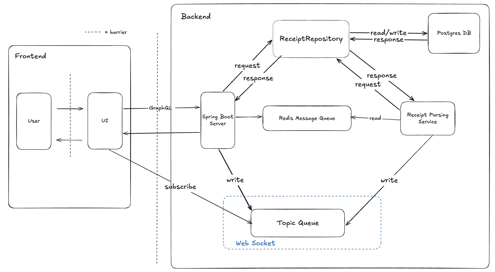
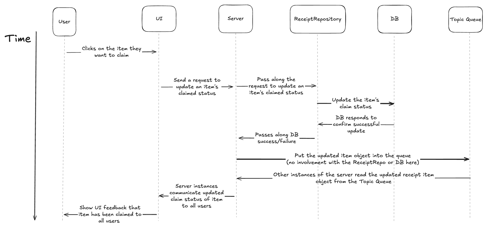

# RFC #1: Joining a Session & Claiming Items

## Motivation
The goal of this feature is to allow group members to join the shared lobby and concurrently claim receipt items within said lobby. When the group leader enters their party size, name, and their receipt, a link will be generated. This link will take all users to the same shared session where they can claim items and receive real-time updates on actions taken in the session. Even if two users click “claim” on the same item at the same exact time, only one user will be able to properly claim it, and the database will act as the “single source of truth” for who owns what. Relating to this, a user must “lock” an item in order to claim it. When a user properly claims an item, all other users must be able to see the change immediately without refreshing the page (via the WebSocket). 

## Updated Architecture Overview
In order to better handle concurrency control, we are choosing to encapsulate the responsibility of handling all requests for database reads and writes within the ReceiptRepository so that there is only ever one entity interacting with our database. That way, it is easier to centralize database-specific concurrency controls that ensure atomic database operations within the ReceiptRepository and Postgres DB in the face of incoming requests coming from both the Spring Boot Server and Receipt Parsing Service.

## Updated Sequence Diagram
The following sequence diagram for claiming items has been updated to reflect the addition of the ReceiptRepository into our system diagram. To optimize for consistency and to prevent concurrency issues where a slow network causes a user from referencing out of date information regarding an item in a database, we also updated the sequence diagram so that the server waits for confirmation that the database has been successfully updated with the claimed item before that claim is communicated to other users via the topic queue. 

## Failure Modes

### Synchronization Failure
This occurs when the Topic Queue and UI lose synchronization during the UI streaming process. If the network is under heavy load, it is possible that the UI receives an itemParsed notification and displays that item before the ReceiptRepository has finished the write query to the DB. Here, a user may attempt to claim an item, but the server would return an error because the item ID technically does not exist within the DB yet. 

**To solve this**, our system will ensure that we perform sequential writes and use an acknowledgement-based workflow. The ReceiptRepository will commit to the DB first, and it will only publish to the Topic Queue after receiving an acknowledgement from the database that the write was successful. If an item claim fails, then the UI should catch the error and retry the fetch after a short debounce. 

### WebSocket Connection Dropped

This occurs when the real-time broadcast layer leaves the UI in a stale state. Here, the Spring Boot Server or Topic Queue crashes/loses its internal connection while the Receipt Parsing Service continues to process the receipt in the background. The parsed items are correctly saved to the DB, but the subscription link to the UI is severed. Essentially, the status of the receipt will be “PARSING” indefinitely even though the data is ready. 

**To solve this**, the UI must implement a heartbeat, which are commonly used when using WebSockets. If no items are received within a certain time interval, the UI should bypass the WebSocket and perform a manual GraphQL request to the server to hydrate the current, ACTUAL state of the DB. 

### Item Claimed Simultaneously

This occurs when two users send a claimItem GraphQL request to our server at the exact same time for the same item. If the server processes both requests as simple CRUD updates, then the DB could end up being inconsistent with ownership data, OR the Topic Queue might broadcast two different owners. 

**To solve this**, all claimItem requests MUST be handled as atomic transactions at the DB level. The ReceiptRepository must wait for some kind of acknowledgement from the DB (response) confirming which user successfully “locked” the row/item before it performs a write operation to the Topic Queue to update the rest of the group. 