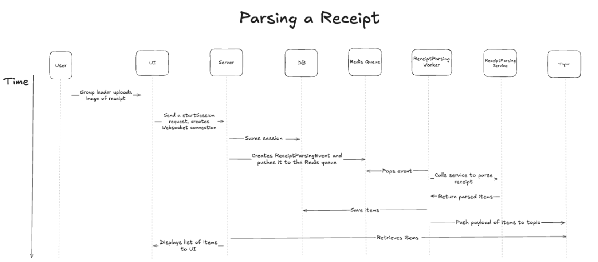

# Parsing Receipts

## Motivation/Description

The goal of this feature is to allow the group leader to upload a photo of the receipt and receive an organized list of items back. After the leader uploads the photo, the web app will take the image and call the Tesseract external library engine to parse the receipt for the items, prices, and tax/tip information. We will return this information to the user and organize all items in a clear manner so that the users in the session can claim their items accordingly.

## Sequence Diagrams

This is the sequence diagram for parsing a receipt. First, the user (leader) will upload an image of the receipt, which starts a session for them. The session information is saved to the database, and the server creates a ReceiptParsingEvent to push to the Redis queue. From there, the ReceiptParsingWorker will pop the event from the queue and call the ReceiptParsingService to perform the actual parsing logic. The items will be returned to the Worker, which saves the items to the database and then creates a payload with information about the items to push to the Topic so that the information can be displayed in the UI.

## Failure Modes (3)

1. **WebSocket Connection Drop:**
   This occurs when the real-time broadcast layer leaves the UI in a stale state. Here, the Spring Boot Server or Topic Queue crashes/loses its internal connection while the Receipt Parsing Service continues to process the receipt in the background. The parsed items are correctly saved to the DB, but the subscription link to the UI is severed. Essentially, the status of the receipt will be “PARSING” indefinitely even though the data is ready.
   To solve this, the UI must implement a heartbeat, which is commonly used when using WebSockets. If no items are received within a certain time interval, the UI should bypass the WebSocket and perform a manual GraphQL request to the server to hydrate the current, ACTUAL state of the DB.
2. **Data Inconsistency:**
   Because the server is writing to the database and pushing an event to the Redis queue, it is possible that one operation fails. If the data is not successfully saved to the database but is successfully pushed to the Redis queue, the server will encounter errors when trying to update the item’s claim status in the database. This means that users will not be able to claim any items.
   To solve this, we will make sure that the data is saved to the database first through a sequential write. First, we will store the items in the database and wait until the database returns the saved object. This confirms that the data has been stored. Then, the server will push the event to the Redis queue.
3. **High Traffic:**
   In cases where there is extremely high traffic and a large number of receipts being uploaded for parsing, the amount of API requests being sent to the server can be overwhelming. This can potentially crash the ReceiptParsingService because of the workload.
   To solve this, we are implementing a ReceiptParsingWorker to ensure that the ReceiptParsingService does not get overloaded. The worker will pop events from the Redis queue at certain time intervals and then call the ReceiptParsingService to perform the parsing logic. This prevents direct access to the Service and allows for a middleman to control the amount of requests.
