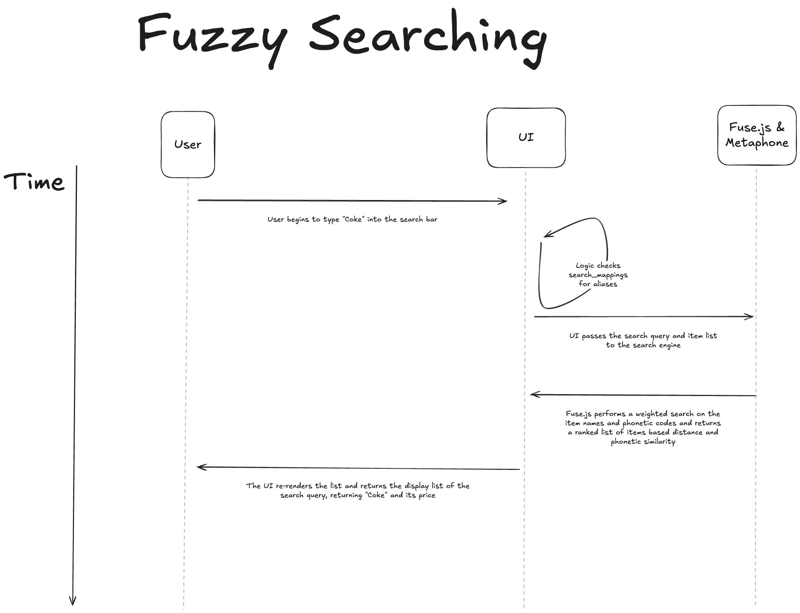

## Fuzzy Search
## Motivation/Description
The goal of this feature is to estimate what a user is trying to search for by implementing a fuzzy searching algorithm. We will use a distance library, fuse.js, to determine similarity between words or phrases so that we can display a list of similar items to the user. We also use Metaphone, a phonetic algorithm that standardizes item names based on their pronunciation. This saves time and improves user experience by showing them accurate results even if their search included typos or mistakes.

## Sequence Diagram
This sequence diagram illustrates the client-side execution of fuzzy search. First, the user enters a search query (e.g., Coke) into the UI search bar. The UI immediately processes this query by checking a local alias dictionary, then uses the Metaphone library to generate phonetic codes for the query and the existing item list. Fuse.js then does a weighted search to calculate the similarity distance between the search query and list items. Lastly, the UI re-renders and returns a ranked list of the closest matches, including their prices. By handling this logic in the UI using Fuse.js and Metaphone, we avoid a database trip for every new keystroke, enabling a quick, responsive search for the user.

## Failure Modes (3)

### Metaphone Library Failure:
It is possible that when the metaphone function encounters unsupported characters that are not standard English text, such as symbols or specialized Unicode characters, it could cause unexpected behavior. 

To solve this, we wrapped the metaphone function in a try/catch block. If an error occurs, and we are in the catch block, the code logs the failure and instead does a lowercase string comparison, so the search remains functional even if the phonetic enhancement was not successful.

### Siloing with Alias Dictionary:
Since the Fuse.js library cannot automatically map brand-specific aliases like “Coca-Cola” to “Coke”, these are defined manually in the search_mappings dictionary. If a user enters a variation that is not in the pre-defined dictionary, the search may fail to find the item even though it is a logical match.

To solve this, we set the threshold to 0.4 in Fuse.js. The threshold controls the accuracy and strictness of the fuzzy search algorithm (where 0.0 is the strictest and 1.0 is the loosest).

### UI Streaming:
It is possible the user could feel that the UI is not responsive while waiting for the full list to load up, so they can search for their items.

To solve this, we use UI streaming with skeletons. While the backend is processing, the UI renders an animated skeleton to provide immediate visual feedback for the user. As items are finished parsing, the UI switches from the skeleton to the actual list items, allowing the user to view the item list and go on with their tasks.